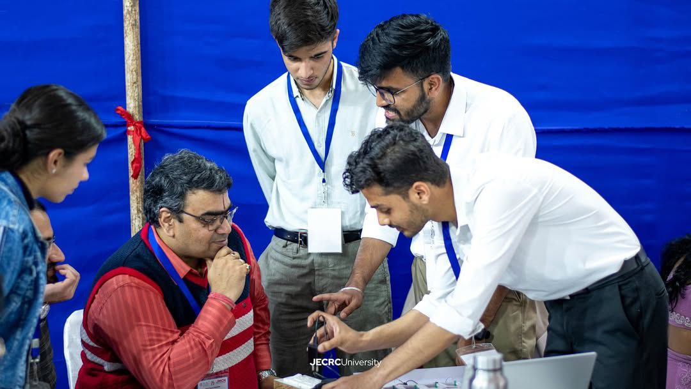
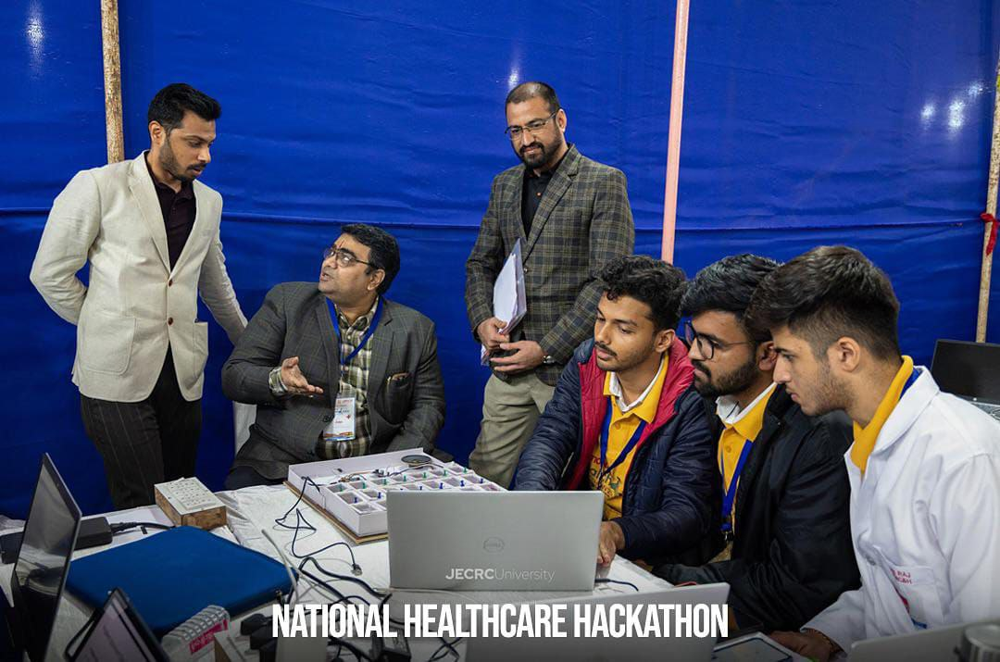
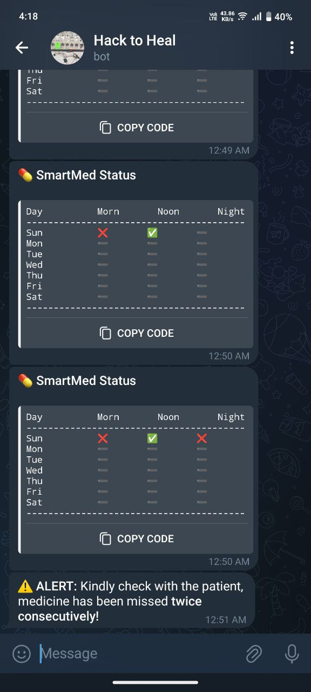
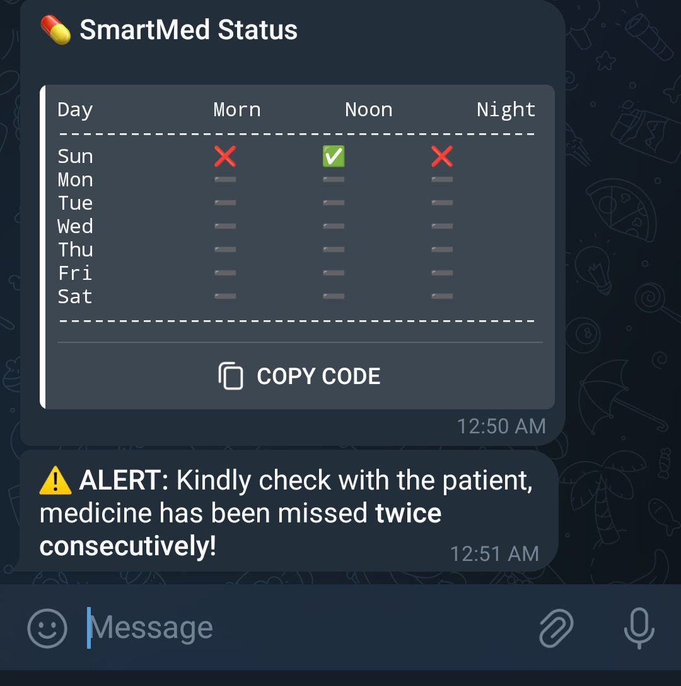
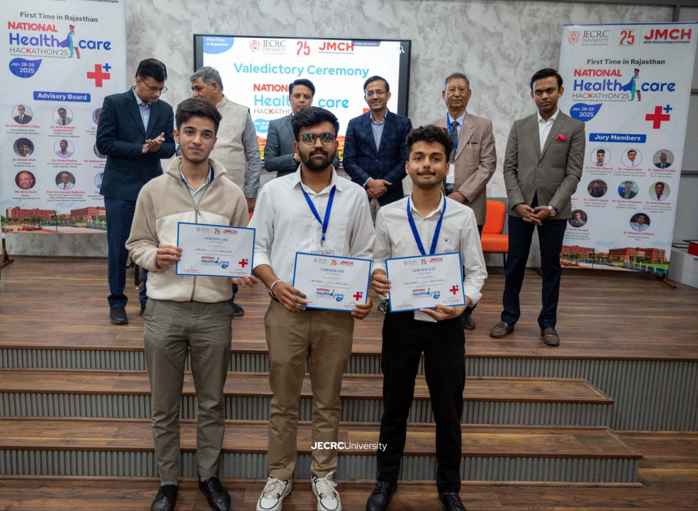
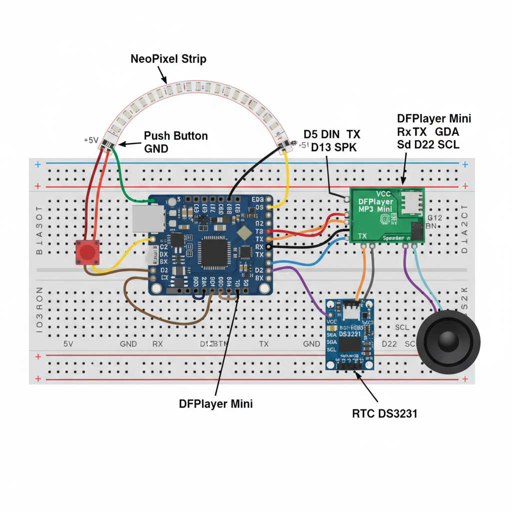

# 💊 IoT-Based Smart Medicine Dispenser  
🚀 Revolutionizing Medication. One Dose at a Time.  


---

## 🏆 Achievements  
- Ranked **Top 6 of 100+ Teams** | *National Healthcare Hackathon (Jan–Feb’25)*  
- Won **₹2100 prize** for our innovative solution in digital healthcare  
- Evolved from a **hackathon prototype** → **product-level device**  
- Pilot rural deployment showed **60% reduction in missed doses**  

---

## 📖 Project Overview  
Forgetful patients, senior citizens, and rural communities often miss critical doses.  
This dispenser ensures **no pill is ever missed again**.  

✨ **Features:**  
- **21-slot smart dispenser** → Morning / Noon / Night doses  
- **ESP32 + NeoPixel LEDs** → color-coded reminders  
- **Voice alerts** with DFPlayer Mini + speaker  
- **One-tap button feedback** → Logs `"Taken"` or `"Missed"`  
- **IoT integration**:  
  - 📱 **Blynk App** → remote monitoring  
  - 🤖 **Telegram Bot** → instant notifications to caregivers  
- **3D-printable modular enclosure** → Fusion360 + STL files  
- **WebSocket server** → real-time data updates  

---
## Documentation

All project-related documents, STL files, and images are organized in the `Docs` folder.

### 3D Printable Enclosure (STL Files)
- [Bottom Layer](Docs/stl/BOTTOM_LAYER.stl)
- [Door](Docs/stl/DOOR.stl)
- [Middle Layer](Docs/stl/MIDDLE_LAYER.stl)
- [Top Layer](Docs/stl/TOP_LAYER.stl)

### Project Images
- 
- 
- 
- 
- 
- 
- 

### Project PDFs
- [Project Report](Docs/pdf/Project_Report.pdf)
- [Automated Medicine Dispenser Design](Docs/pdf/Automated%20Medicine%20Dispenser%20Design.pdf)
- [Circuit Board Diagram](Docs/pdf/CIRCUIT%20BOARD%20DIAGRAM%20.pdf)
- [ESP32 Project Troubleshooting](Docs/pdf/ESP32%20Project%20Troubleshooting%20(1).pdf)

## 🛠️ Hardware Used  
- ESP32  
- NeoPixel LED Strip (61 LEDs)  
- DFPlayer Mini + Speaker  
- Real-Time Clock (RTC)  
- Push Button  
- 3D-Printed Modular Enclosure (Fusion360)  

---

## 🔧 Tech Stack  
- **Programming:** Arduino C++ (ESP32)  
- **IoT Platforms:** Blynk, Telegram Bot API, WebSockets  
- **Design:** Fusion360  
- **Hardware:** Modular 3D casing  

---

## 📂 Repository Structure  
```

IoT-Based-Smart-Medicine-Dispenser/
├── Firmware/       # ESP32 code
├── Hardware/       # Circuits + Enclosure
├── Docs/           # Reports, Images
└── Demo/           # Video & Screenshots

````
## Circuit Diagram


---

## 🚀 Getting Started  
### 1️⃣ Clone the repo  
```bash
git clone https://github.com/arunilkeshri/IoT-Based-Smart-Medicine-Dispenser.git
````

### 2️⃣ Install dependencies

* Install [Arduino IDE](https://www.arduino.cc/en/software)
* Required libraries:

  * `Adafruit_NeoPixel`
  * `WebSocketsServer`
  * `WiFi.h`
  * `Blynk`
  * `UniversalTelegramBot`

### 3️⃣ Upload the firmware

* Open `Firmware/dispenser.ino` in Arduino IDE
* Select **ESP32 board** and upload

---

## 🎥 Demo

* Video & screenshots are in the `Demo/` folder
* You can watch [Demo Video here](https://github.com/arunilkeshri/IoT-Based-Smart-Medicine-Dispenser/blob/main/Demo/demo-video.mp4)

---

## 👨‍👩‍👦 Team & Mentors

* **Team:** Arunil Keshri, Yash Joshi
* **Mentors:** Arpit Agrawal Sir, Dr. Ravi Shankar Sharma, Mahesh Kumar Joshi Sir

---

## 📜 License

Licensed under the **MIT License**. Free to use with attribution.

---

## 🌟 Acknowledgement

> “We have to save our crucial brain neurons for more important work rather than wasting them on unproductive tasks.” – *Arpit Agrawal Sir*

This thought became the soul of our mission.

---

## 🔗 Connect With Me

💼 [LinkedIn – Arunil Keshri](https://www.linkedin.com/in/arunil-keshri/)
💻 [GitHub – IoT-Based Smart Medicine Dispenser](https://github.com/arunilkeshri/IoT-Based-Smart-Medicine-Dispenser)


